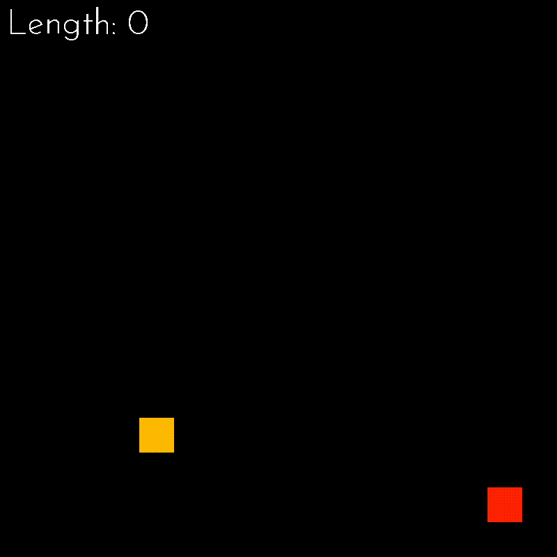

# Project Snake

[]()
[]()

### The purpose of project:
Make a copy of game "snake" on Python with library Pygame

### Technology stack:
- **Languages:**
  - Python 3.9+
- **Libraries:**
  - Pygame
- **Code Analyzers:**
  - Pylint

### System requirements:
- Linux | Mac OS | Windows

### Quick setup:
1. Clone a project
2. Create venv (in Pycharm: settings -> project "Snake" -> project interpreter)
3. Upgrade pip:
    ```bash
    pip install --upgrade pip
    ```
4. Install requirements: 
    ```bash
    pip install -r requirements.txt
    ```
5. Run file run.py

## Game demo:

